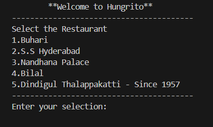
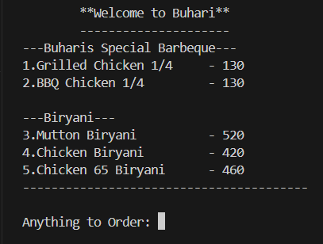

# 🍔 Hungrito Food Ordering System

Hungrito is a simple command-line food ordering application developed in Java. It allows users to browse a menu, place food orders, and receive the final bill – all from the terminal. Ideal for beginners learning Java and console-based app development.

---

## 📸 Screenshots

### 🧾 Restaurant Display


### 🛍 Sample Menu Display


---

## 🛠 Features

- 📋 Interactive food menu with multiple items
- 🔢 User input handling for item selection and quantity
- 💰 Bill calculation with total amount
- 🔁 Looping for multiple orders until user exits

---

## 🚀 Getting Started

### ✅ Prerequisites

- Java JDK 8 or above
- Text editor or IDE (IntelliJ, Eclipse, VS Code, etc.)
- Command Line / Terminal

---

### 🔧 Installation & Execution

1. *Clone the Repository*
   ```bash
   git clone https://github.com/your-username/hungrito-food-order.git
   cd hungrito-food-order
   javac Hungrito_Food_Order.java
   java Hungrito_Food_Order

## 🙋‍♂ Author

*Jayanth T*  
📧 jayantht68@gmail.com  
📍 Chennai, India  
🔗 [LinkedIn](https://www.linkedin.com/in/jayanth-t-j7604)
